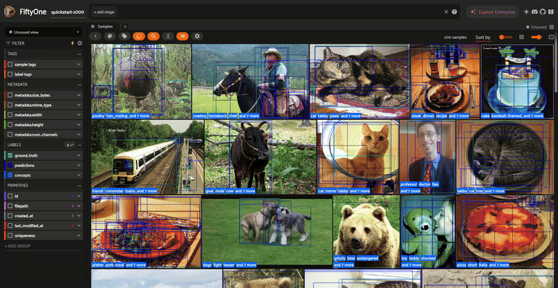

# 🧬 FiftyOne SpLiCE Panel & Operator

A custom **FiftyOne plugin** for exploring and interpreting image-level and dataset-level concept decompositions using **SpLiCE** (Sparse Linear Concept Embeddings). This toolkit helps users visualize, analyze, and detect **spurious correlations** in datasets using interpretable CLIP embeddings.



## 🚀 What This Plugin Offers

### 🔧 Operator: `Decompose Core Concepts`

This operator performs per-image concept decomposition using a CLIP-based model to extract and store the most influential human-interpretable concepts, their contribution weights, and similarity metrics for each image.

#### ✅ Features

* **Multiple CLIP Backbones**:
  * `open_clip:ViT-B-32` (default)
  * `clip:ViT-B/32`, `ViT-B/16`, `RN50`
* **Flexible Vocabularies**:
  * `laion`, `mscoco`, `laion_bigrams`
* **Customizable Parameters**:
  * `vocab_size`, `l1_penalty`, `top_k concepts`, `batch_size`
* **Rich Output Data**:
  * `concepts`: list of top contributing concepts with weights
  * `l0_norm`: decomposition sparsity measure
  * `reconstruction_error`: similarity to original CLIP vector

### 📊 Panel: `Concept Decomposition`

An interactive panel interface with **dynamic view-based analysis** for comprehensive concept exploration.

#### 🎯 **Key Capabilities**

**🔄 Dynamic View Integration**: The panel automatically responds to your current FiftyOne view, showing concept statistics for filtered subsets of your data.

**📈 Multi-Level Analysis**: From dataset-wide trends to individual image insights, explore concepts at every level.

**🔍 Bias Detection**: Identify spurious correlations and dataset biases that could affect model performance.

#### 📍 **Pages Overview**

Page 1. **📊 Dataset-Level Concept Summary**
   * **Dynamic view analysis** - automatically updates based on your current view
   * **Top x concepts** ranked by average contribution across samples
   * **Mean weights and occurrence counts** for each concept
   * **Overall statistics**: L0 norm and cosine similarity metrics
   * **Perfect for**: Understanding what concepts dominate your dataset or filtered view

   **🏷️ Class-Level Decomposition**
   * **Class-specific analysis** - select any class to see associated concepts
   * **Filtered statistics** for samples containing the selected class
   * **Concept-class relationships** to understand how models represent specific categories
   * **Perfect for**: Understanding how different classes are represented in concept space

   **🖼️ Image-Level Decomposition**
   * **Individual image analysis** - select any image to see its concept breakdown
   * **Detailed concept weights** and individual metrics
   * **Real-time updates** when selecting different images
   * **Perfect for**: Debugging specific images or understanding individual predictions

Page 2. **🧪 Spurious Correlation Discovery**
   * **Bias detection tool** - identify unintended concept-class correlations
   * **Visual correlation analysis** across all classes
   * **Dataset shortcut identification** that models might exploit
   * **Perfect for**: Finding and fixing dataset biases before they affect model training

## 🔌 Installation

### 1. Choose a CLIP backend

**OpenCLIP** (recommended):
```bash
pip install open_clip_torch
```

**OpenAI CLIP**:
```bash
pip install git+https://github.com/openai/CLIP.git
```

### 2. Download the plugin

```bash
fiftyone plugins download https://github.com/AdonaiVera/fiftyone-sparse-concepts
```

---

## 🔍 How to Use

### **Step 1: Run the Concept Decomposition Operator**

```python
import fiftyone as fo
import fiftyone.zoo as foz
import fiftyone.operators as foo

# Load your dataset
dataset = foz.load_zoo_dataset("quickstart", max_samples=100)

# Run the SpLiCE decomposition
foo.execute_operator(
    "@adonaivera/fiftyone-sparse-concepts/decompose_core_concepts",
    dataset=dataset,
    view=dataset.view(),
    params={
        "model": "open_clip:ViT-B-32",
        "vocabulary": "laion",
        "vocab_size": 10000,
        "l1_penalty": 0.25,
        "top_k": 10,
        "batch_size": 32,
        "return_cosine": True,     
        "save_l0_norm": True,       
        "label_field": "concepts",  
    },
)
```

### **Step 2: Launch FiftyOne and Explore**

```python
session = fo.launch_app(dataset)
session.wait()
```

### **Step 3: Use the Concept Decomposition Panel**

1. **Switch to the panel**: Look for "Concept Decomposition" in your panels
2. **Start with Page 1**: Get an overview of your dataset's concept distribution
3. **Filter your view**: Use FiftyOne's filtering tools to explore specific subsets
4. **Navigate between pages**: Use the arrow navigation to explore different analysis levels
5. **Select classes**: Use the dropdown on page 2 to analyze concepts for specific classes
6. **Select images**: Click on images to see their individual concept breakdowns on page 3
7. **Discover biases**: Use page 4 to identify spurious correlations

## 🎯 **Practical Use Cases**

### **🔍 Dataset Analysis**
- **Understand your data**: See what concepts dominate your dataset or filtered views
- **Quality assessment**: Identify potential biases or data quality issues
- **Subset comparison**: Compare concept distributions across different data splits

### **🧠 Model Interpretability**
- **Debug predictions**: Understand why your model makes specific decisions
- **Concept discovery**: Find human-interpretable concepts your model learns
- **Bias detection**: Identify spurious correlations that could affect fairness

### **📊 Research & Development**
- **Dataset curation**: Use concept analysis to improve dataset quality
- **Model comparison**: Compare concept representations across different models
- **Ablation studies**: Understand which concepts are most important for performance

### **🚀 Production Monitoring**
- **Drift detection**: Monitor concept distributions for data drift
- **Quality control**: Ensure new data maintains expected concept patterns
- **Explainability**: Provide interpretable explanations for model decisions

## 💡 **Pro Tips**

### **Getting the Most from Dynamic Views**
1. **Filter by class**: Use FiftyOne's class filters to see concept distributions for specific categories
2. **Filter by metadata**: Explore concepts in specific subsets (e.g., high-confidence predictions)
3. **Compare splits**: Create views for train/val/test sets and compare concept distributions
4. **Temporal analysis**: Filter by date ranges to see how concepts change over time

### **Understanding the Metrics**
- **L0 Norm**: Lower values indicate sparser (more focused) concept representations
- **Cosine Similarity**: Higher values indicate better reconstruction of original embeddings
- **Mean Weight**: Higher values indicate more influential concepts
- **Count**: Shows how frequently a concept appears across samples

### **Optimizing Parameters**
- **`l1_penalty`**: Increase for sparser decompositions, decrease for denser ones
- **`top_k`**: Increase to see more concepts per image, decrease for focus on top concepts
- **`vocab_size`**: Larger vocabularies offer more concept diversity but may be less interpretable


## 🔮 Future Enhancements

We're actively improving this plugin with planned features:

### **🚧 Coming Soon**
1. **Multi-Model Support**: Support for any vision-language model beyond CLIP
2. **Interactive Concept Editing**: Modify concept weights and see impact on predictions
3. **Concept Clustering**: Group similar concepts for higher-level analysis
4. **Export Capabilities**: Save concept analysis results for external use

### **🔬 Advanced Features**
- **Concept Intervention Studies**: Test how changing concepts affects model outputs
- **Retrieval Benchmarks**: Use concept signatures for similarity search
- **Zero-Shot Evaluation**: Assess concept alignment with ground truth labels

## 🧠 Based On Research

This plugin implements the decomposition techniques from:

> **SpLiCE: Interpreting CLIP with Sparse Linear Concept Embeddings**
> *Usha Bhalla, Alex Oesterling, Suraj Srinivas, Flavio P. Calmon, Himabindu Lakkaraju*
> [arXiv:2402.10376v2](https://arxiv.org/abs/2402.10376)

Bring **mechanistic interpretability** to your visual embeddings with this research-backed approach.

## 🙌 Credits

* Built with ❤️ on top of FiftyOne by Voxel51
* SpLiCE paper implementation adapted for batched inference
* Concept visualization powered by `plotly` and custom FiftyOne views

## 👥 Contributors

This plugin was developed and maintained by:

* [Adonai Vera](https://github.com/AdonaiVera) 
* [Jacob Sela](https://github.com/jacobsela) 

We welcome more contributors to extend support for models, vocabularies, and new experiment panels!
